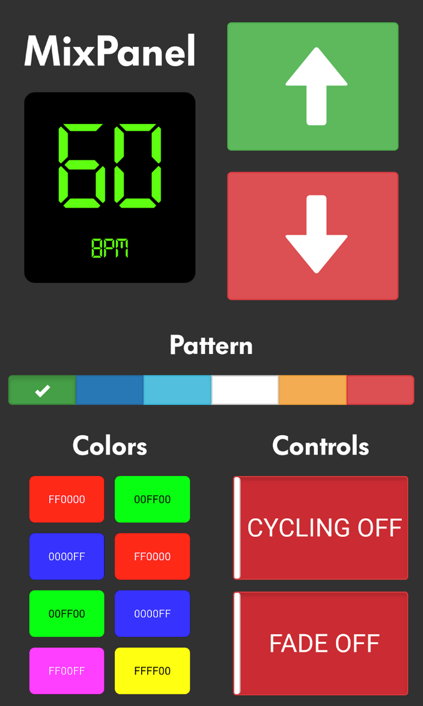
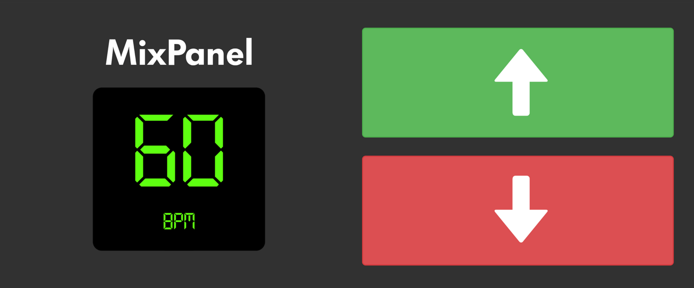
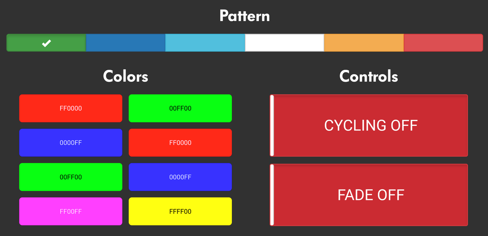

# tplight-web 
## a web interface for controlling tplink lightbulbs.

### Setup
#### Configuration
Set [`colorBulbIP`](https://github.com/JamesTwisleton/tplight-web/blob/7e3ee072e8bc1ca5ea8d28271715a91f47860194/config/config.json#L3)  in `config/config.json` to the IP address of the bulb. We recommend setting up a static IP for your bulb on your router.

#### Installation
Install [Node.js](https://nodejs.org/en/) and [npm](https://www.npmjs.com/)

`npm install` to install.-

Added stuff

#### Deployment
`sudo node server.js` to deploy a server on localhost with ability to control [tplink-lightbulb](https://github.com/konsumer/tplink-lightbulb)s. Go to localhost in a browser window to use. 

To use from another device on the same network, type the server machines IP address into a browser window.

### Issues to resolve
- [x] Pattern choosing
- [ ] concurrency broken as switches don't update across clients.
- [ ] cycling off and fade off sometimes don't work.
- [ ] color picker disabled - infrastructure exists to change bulb color, but need to adapt
color picking and setting code to interface with server stored patterns.
- [ ] Saving user created patterns to file.
- [ ] Using sockets to more efficiently persist state between server and clients.
- [ ] More fluid frontend speed changes. Previously had it set to change in increments of 5, but decided it lacked granularity. Make it so when you hold down the button, it slowly increases in speed (IE, how fast the BPM changes).
- [ ] Image based color changes
- [ ] Real time image based color changes

